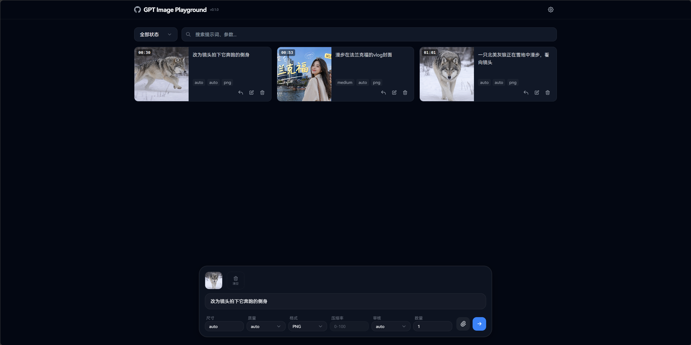
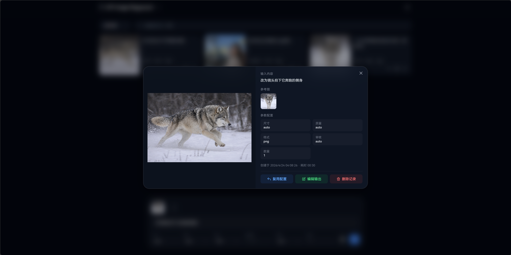
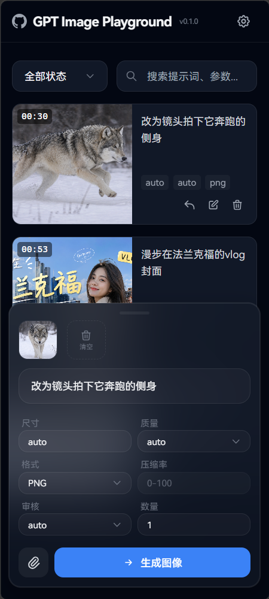

# GPT Image Playground

🎨 基于 OpenAI `gpt-image-2` 接口的图片生成与编辑工具。提供简洁的 Web UI，支持文本生成图片、参考图编辑、参数调节与历史记录管理。

## 示例截图

| 主界面 | 任务详情 | 移动端 |
|:---:|:---:|:---:|
|  |  |  |

## 功能特性

### 1. 图片生成与编辑
- **文本生图**：输入提示词，调用 `images/generations` 接口生成图片。
- **参考图编辑**：上传参考图（最多 16 张），调用 `images/edits` 接口进行图片编辑。
- **多图输入**：支持文件选择、粘贴、拖拽三种方式添加参考图。

### 2. 参数控制
- **尺寸**：`auto` 或自定义 `WxH`（宽高需为 16 的倍数）。
- **质量**：`auto`、`low`、`medium`、`high`。
- **输出格式**：`PNG`、`JPEG`、`WebP`。
- **压缩率**：0-100（仅 JPEG / WebP 生效）。
- **审核强度**：`auto`、`low`。
- **批量生成**：单次最多生成多张图片。

### 3. 历史记录管理
- **任务卡片**：生成记录以卡片形式展示，包含缩略图、提示词、参数和耗时。
- **搜索与筛选**：按关键词搜索，按状态（全部 / 生成中 / 完成 / 失败）筛选。
- **复用配置**：一键将历史记录的提示词和参数回填到输入框。
- **编辑输出**：将生成结果作为参考图添加到输入，进行迭代编辑。
- **详情弹窗**：点击任务卡片查看完整信息，支持图片切换与灯箱浏览。

### 4. 数据管理
- **本地存储**：所有任务记录与图片数据存储在浏览器 IndexedDB 中，数据不离开本地。
- **导入 / 导出**：支持将全部数据导出为 JSON 文件，也可从文件导入。
- **图片去重**：基于 SHA-256 哈希自动去重，避免重复存储。

### 5. API 配置
- **自定义端点**：支持配置 Base URL，兼容 OpenAI 官方 API 及第三方中转。
- **模型 ID**：可自定义模型标识。
- **超时控制**：可配置请求超时时间。

## 快速开始

### Docker 部署

```bash
# 构建镜像
docker build -t gpt-image-playground .

# 运行容器
docker run -d -p 8080:80 gpt-image-playground
```

浏览器访问 `http://localhost:8080`。

也可以使用 `docker compose`：

```yaml
services:
  gpt-image-playground:
    build: .
    ports:
      - "8080:80"
    restart: unless-stopped
```

```bash
docker compose up -d
```

### GitHub Pages 部署

本项目已包含 GitHub Actions 工作流（`.github/workflows/deploy.yml`），推送到 `main` 分支后会自动构建并部署到 GitHub Pages。

启用步骤：

1. 进入仓库 **Settings → Pages**。
2. **Source** 选择 **GitHub Actions**。
3. 推送代码到 `main` 分支，等待 Action 完成即可。

### 构建产物

```bash
npm run build
```

构建产物在 `dist/` 目录下，可部署到任意静态文件服务器。

### 本地开发

```bash
# 安装依赖
npm install

# 启动开发服务器
npm run dev
```

浏览器访问 `http://localhost:5173`，在右上角设置中填入 API Key 即可使用。

## 技术栈

- [React](https://react.dev/) 19 + [TypeScript](https://www.typescriptlang.org/)
- [Vite](https://vite.dev/)
- [Tailwind CSS](https://tailwindcss.com/) 3
- [Zustand](https://zustand.docs.pmnd.rs/) 状态管理
- IndexedDB 本地持久化

## 许可证

[MIT](LICENSE)
